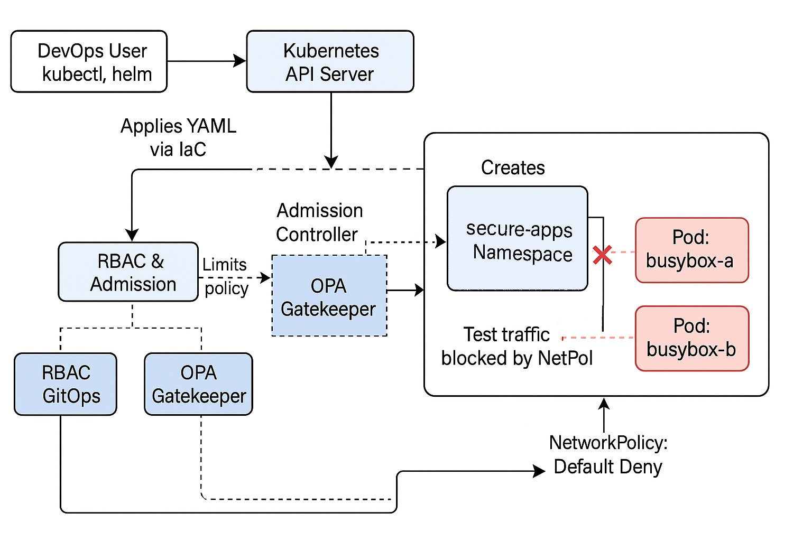

## Kubernetes Infrastructure as Code Security Lab.

Automated lab to provision, secure, and enforce best practices on Kubernetes clusters and workloads using Infrastructure as Code, RBAC, NetworkPolicy, GitOps and Policy as Code.

---

## Table of Contents

- [Overview](#overview)
- [Real-World Risk](#real-world-risk)
- [What I Built](#what-i-built)
- [Diagram](#diagram)
- [Objectives](#objectives)
- [Steps Performed](#steps-performed)
  - [1. Prerequisite Setup]
  - [2. Cluster Spin-Up]
  - [3. Namespace Creation]
  - [4. RBAC Enforcement]
  - [5. RBAC Test]
  - [6. NetworkPolicy Enforcement]
  - [7. Admission Controller Enforcement]
  - [8. Cleanup]
- [Bonuses](#bonuses)
  - [1.1 GitOps with ArgoCD]
  - [1.2 Policy as Code with Gatekeeper]
- [Screenshots](#screenshots)
- [Lessons Learned](#lessons-learned)
- [Notes and Limitations](#notes-and-limitations)
- [References](#references)
- [Cleanup](#cleanup)
- [Contact](#contact)

---

## Overview

This lab demonstrates the secure provisioning and hardening of a Kubernetes cluster using Infrastructure as Code (IaC) and leading DevSecOps practices.  
Each step is hands-on and fully reproducible, ideal for DevOps portfolios.

---

## Real-World Risk

Kubernetes clusters are frequent targets for attacks—including privilege escalation, lateral movement and cryptomining—due to insecure defaults or misconfiguration.  
Without strong RBAC, network isolation and policy enforcement, a single compromised pod or user can lead to full-cluster breaches, leaked secrets and lost trust.

This lab demonstrates how to **proactively prevent real-world attacks** by:
- Enforcing least-privilege permissions at every layer (user, pod and network)
- Blocking risky or non-compliant workloads before they run.
- Using Policy as Code to automate and audit cluster security posture.

The exact same techniques translate directly to cloud and production environments.

---

## What I Built

A step-by-step, security-focused Kubernetes lab—built entirely with Infrastructure as Code—that:
  - Provisions a local Kubernetes cluster (Minikube) with secure defaults.
  - Applies least-privilege RBAC, default-deny NetworkPolicy and restricted PodSecurity.
  - Demonstrates hands-on attack/defense scenarios (privilege tests, blocked traffic, API enforcement)
  - Adds bonus DevSecOps controls: GitOps automation with ArgoCD and Policy as Code with OPA Gatekeeper.

All configuration and security policies are version-controlled as YAML for full reproducibility and auditability.

---

## Diagram

---

## Objectives

- Spin up a secure Kubernetes cluster (Minikube)
- Enforce least-privilege RBAC.
- Apply default-deny Network Policies.
- Enable and test Admission Controllers.
- Bonus: Show GitOps (ArgoCD) and Policy as Code (OPA Gatekeeper)

---

## Steps Performed

**1. Prerequisite Setup**
   - Installed Docker Desktop, Minikube, kubectl and Helm on Windows.
   - Validated CLI tools and system status *(Screenshot: `prereqs-terminal.png`)*

**2. Cluster Spin-Up**
   - Started Minikube with security flags and audit logging *(Screenshot: `cluster-up-terminal.png`)*

**3. Namespace Creation**
   - Created a dedicated `secure-apps` namespace for isolated workloads *(Screenshot: `namespaces-terminal.png`)*

**4. RBAC Enforcement**
   - Created ServiceAccount, Role and RoleBinding for pod listing only.
   - Tested limited privileges: ServiceAccount could not read secrets *(Screenshots: `rbac-resources.png` & `rbac-test.png`)*

**5. RBAC Test**
   - Demonstrated that the ServiceAccount is truly locked down with a direct pod shell test *(Screenshot: `rbac-wow-test.png`)*

**6. NetworkPolicy Enforcement**
   - Applied a default-deny NetworkPolicy.
   - Deployed busybox pods and tested pod-to-pod communication—confirmed blocked by policy *(Screenshot: `netpol-enforced.png` & `netpol-test.png`)*

**7. Admission Controller Enforcement**
   - Enabled Pod Security Admission (restricted mode)
   - Attempted to deploy privileged pod—blocked at the API level *(Screenshot: `admission-controllers.png`)*

**8. Cleanup**
   - Delete Minikube cluster (minikube delete)
   - Optionally, stop/quit Docker Desktop.

---

## Bonuses

**1.1 GitOps with ArgoCD**
   - Installed ArgoCD, exposed the UI with port-forward and displayed login screen *(Screenshot: `bonus-argocd-ui.png`)*

**1.2 Policy as Code with Gatekeeper**
   - Installed OPA Gatekeeper.
   - Enforced a policy: All pods must set CPU and memory limits.
   - Attempted to deploy non-compliant pod—denied by policy *(Screenshot: `bonus-argocd-opa.png` & `gatekeeper-policy-test.png`)*

---

## Screenshots

*All screenshots are included in the `screenshots/` folder.*

| Step                      | Screenshot Filename          | Description                               |
|---------------------------|------------------------------|-------------------------------------------|
| 1   Prereqs               | prereqs-terminal.png         | Prerequisite tools and CLI validation     |
| 2   Cluster Spin-Up       | cluster-up-terminal.png      | Minikube cluster running                  |
| 3   Namespace Creation    | namespaces-terminal.png      | `secure-apps` namespace created           |
| 4   RBAC Resources        | rbac-resources.png           | RBAC objects applied                      |
| 4   RBAC Test             | rbac-test.png                | ServiceAccount least-privilege test       |
| 5   RBAC Bonus            | rbac-wow-test.png            | Locked-down shell test                    |
| 6   NetPol Enforced       | netpol-enforced.png          | Default-deny policy applied               |
| 6   NetPol Test           | netpol-test.png              | Blocked pod-to-pod ping                   |
| 7   Admission Controllers | admission-controllers.png    | Privileged pod blocked                    |
| 1.1 ArgoCD UI             | bonus-argocd-ui.png          | ArgoCD web UI exposed                     |
| 1.2 Gatekeeper OPA        | bonus-argocd-opa.png         | OPA Gatekeeper installed/policy enforced  |
| 1.2 Gatekeeper Policy     | gatekeeper-policy-test.png   | Gatekeeper blocks non-compliant pod       |

---

## Lessons Learned

- Even local CNIs may not enforce all policies—document the reality!
- Admission controllers add robust, API-level security.
- GitOps and Policy as Code bring production-grade controls to any cluster.

---

## Notes and Limitations

- Minikube with Docker CNI may not fully enforce all NetworkPolicies.
- PodSecurityPolicies are deprecated—used Pod Security Admission labels for modern control.
- ArgoCD and Gatekeeper were installed for local proof-of-concept; for production, use real CI/CD and cloud clusters.

---

## References

- [Kubernetes Official Docs](https://kubernetes.io/docs/)
- [OPA Gatekeeper](https://open-policy-agent.github.io/gatekeeper/website/)
- [ArgoCD](https://argo-cd.readthedocs.io/)
- [Kubernetes Network Policy](https://kubernetes.io/docs/concepts/services-networking/network-policies/)
- [Pod Security Admission](https://kubernetes.io/docs/concepts/security/pod-security-admission/)

---

## Contact

Sebastian Silva C. – August, 2025 – Berlin, Germany  
- [LinkedIn](https://www.linkedin.com/in/sebastiansilc/)  
- [GitHub](https://github.com/SebaSilC)  
- [sebastian@playbookvisualarts.com](mailto:sebastian@playbookvisualarts.com)
